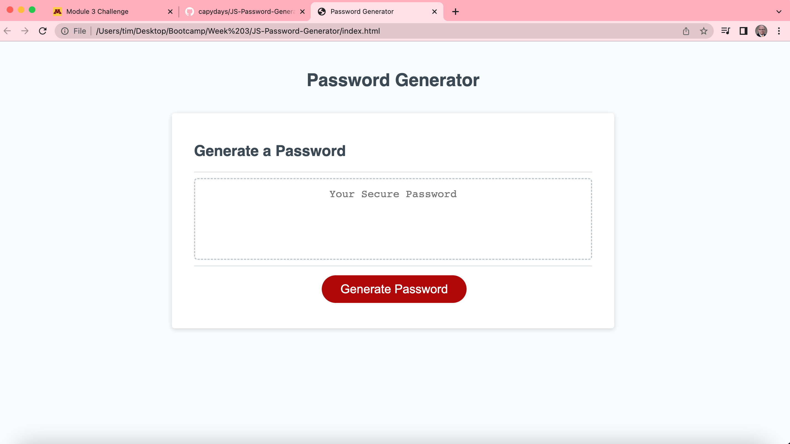

# JS-Password-Generator

## Description

This project was undertaken as the third challenge assement for the U of M Fullstack Bootcamp course. This challenge was aimed at furthering my understanding of JavaScript, specifically functions, for loop iterations, and random number generation. This project helped me further my understanding and use of iterant loops in JS, as well as identifying and implementing object methods/functions to help parse inputs from the user and use those inputs to drive user interaction through JavaScript code.

## Installation

No installation needed. Link to web page here: 

## Usage

This project uses basic HTML aand CSS designs to allow users to interact with JavaScript to create a unique password. The Javascript code uses basic web API methods like .confirm(), .prompt(), and .alert() to provide users to customize certain aspects of their unique password. Customizable aspects of the password inlcude whether or not to include numbers, lower and upper case letters, and special characters. Additionally, the user can select a password length between 8 and 128 characters. Should the user choose a lenght outside the 8 - 128 range, or select no characters for their password customization, they will be prompted to start the process again and choose valid inputs. Users initate the passwrod creation process by clicking the "Generate Password" button. A screenshot is provided below:

## Credits

University of Minnesota Fullstack Bootcamp - Starter HTML, CSS, and JavaScript code
w3schools.com - Additional understanding of for loops and understanding of functions and object methods (including .concat(), .charAt(), and parseInt())

## License

Please refer to the LICENSE in the repo.
